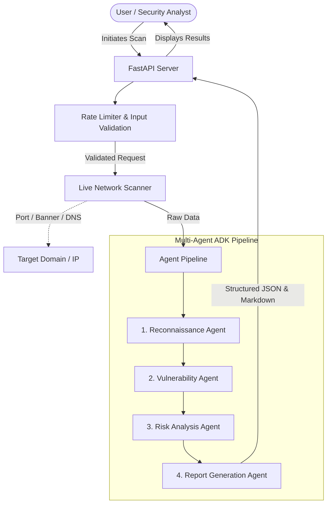
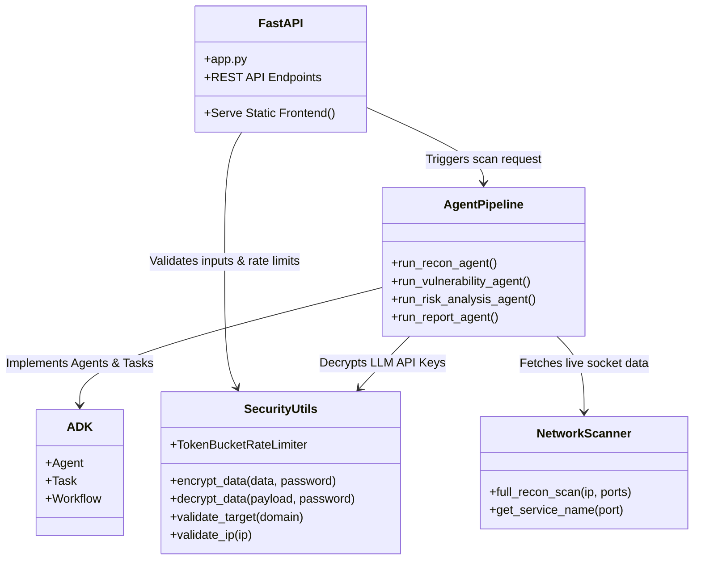

# SentinelAI - Enterprise Multi-Agent Threat Intelligence & Security Scanner

[](https://sentinel-ai-kappa-teal.vercel.app/)

SentinelAI is an advanced, modular, multi-agent cybersecurity scanning and analysis assistant. Leveraging a custom **Agent Development Kit (ADK)**, SentinelAI sequences autonomous AI agents to perform host reconnaissance, match exposures to known CVEs, assess business threat risks, and compile professional executive reports.

SentinelAI is built for adaptability, offering a premium Glassmorphic Web UI, a command-line interface (CLI), and a Model Context Protocol (MCP) Server to expose target scans directly to agentic workflows.

---

## 🌐 Online Use

Want to try SentinelAI immediately without any local setup? Use our hosted online version:

🔗 **[SentinelAI Web Dashboard](https://sentinel-ai-kappa-teal.vercel.app/)**

---

## 🚀 Key Features

* **Multi-Agent Pipeline**: Sequentially triggers **Recon**, **Vulnerability**, **Risk Analysis**, and **Reporting** agents to coordinate a complete security posture scan.
* **FastMCP Server Integration**: Expose `run_security_scan` and `run_custom_security_scan` directly to MCP clients (like Claude Desktop or Gemini IDEs).
* **Hardened Security**:
  * **Input Validation**: Strict validation checking target domain syntax, IP formats, and port lists to prevent script and command injection.
  * **Rate Limiting**: Custom `TokenBucketRateLimiter` protecting API routes from exhaustion and abuse.
  * **Credential Encryption**: AES-256 password-based key encryption for storing API keys securely inside `.env.enc`.
* **Flexible UI / CLI / MCP Interface**: Initiate scans via the premium browser dashboard, terminal commands, or through your favorite MCP host.
* **Automated Mock Profiles & Live Scanning**: Test with predefined mock business profiles, or run live custom network socket and banner grabbing scans.

---

## 🛠️ Technology Stack

SentinelAI is built using a modern, robust, and scalable technology stack:

* **Languages**: Python (Backend/AI Agents), JavaScript (Frontend Dashboard), HTML5, CSS3
* **Backend Framework**: Python 3, FastAPI, Uvicorn (ASGI)
* **Core Packages**: `google-generativeai`, `mcp`, `pydantic`, `cryptography`, `requests`, `dnspython`
* **AI & LLM Integration**: Google Generative AI (Gemini), MCP (Model Context Protocol)
* **Security & Cryptography**: Python `cryptography` module (PBKDF2HMAC, AES-256-GCM)
* **Network Scanning**: Custom socket implementations, DNSPython
* **Frontend UI**: Vanilla JavaScript, HTML5, CSS3 (Glassmorphism design, no heavy frameworks)
* **Containerization**: Docker, Docker Compose

---

## 📊 System Architecture & Working Flowchart

### 1. Working Flowchart
The following diagram illustrates the workflow of the multi-agent scanning pipeline:



### 2. UML Component Diagram
This diagram outlines the core components and their relationships:



---

## 🔌 Offline Deployment & Installation

You can deploy SentinelAI completely offline or locally on your own machine. 

### Method 1: Docker (Recommended)
SentinelAI can be easily deployed in isolated containers. Ensure you have Docker and Docker Compose installed.

1. **Clone the repository**:
   ```bash
   git clone https://github.com/your-username/SentinelAI.git
   cd SentinelAI
   ```
2. **Set your Gemini API Key in `docker-compose.yml`** or export it to your environment.
3. **Build and Run**:
   ```bash
   docker-compose up --build -d
   ```
4. Access the offline web interface at `http://localhost:8000`.

### Method 2: Manual Python Setup (Windows/Linux/macOS)

1. **Clone the repository**:
   ```bash
   git clone https://github.com/your-username/SentinelAI.git
   cd SentinelAI
   ```

2. **Create and Activate a Virtual Environment**:
   ```bash
   # Windows
   python -m venv venv
   venv\Scripts\activate
   
   # Linux / macOS
   python3 -m venv venv
   source venv/bin/activate
   ```

3. **Install Dependencies**:
   ```bash
   pip install -r requirements.txt
   ```

4. **Where to Insert Your Gemini API Key**:
   You must provide a valid Google Gemini API Key for the AI Agents to function. You can provide it in two ways:
   * **Option A (Environment Variable)**: Create a `.env` file in the root directory and add:
     ```env
     GEMINI_API_KEY=your_api_key_here
     ```
   * **Option B (Secure Encrypted Storage)**: Use the built-in CLI to securely encrypt and store your key in a `.env.enc` file:
     ```bash
     python backend/cli.py set-key
     ```
     *(You will be prompted to enter your API key and a secure decryption password).*

5. **Start the FastAPI Web Server**:
   ```bash
   # Make sure DECRYPTION_PASSWORD is set in your environment if you encrypted your key
   python app.py
   ```
6. Open your browser and navigate to `http://127.0.0.1:8000`.

---

## 💻 CLI & Standalone Usage

You can also run scans directly from your terminal using the offline CLI tool:

**Run a scan against a mock profile:**
```bash
python backend/cli.py scan --profile ecommerce
```

**Run a scan and export the executive report to markdown:**
```bash
python backend/cli.py scan --profile clinic --output report.md
```

---

## 📈 How to Analyze Results

Once a scan completes (either via the Web Dashboard or CLI), SentinelAI outputs a **Comprehensive Executive Report**. Here is how to interpret the results:

1. **Reconnaissance Data**: Review the open ports, detected services, and DNS/SSL configurations found during the live or simulated scan. Look out for unexpected open ports (like 3389 RDP or 23 Telnet).
2. **Vulnerabilities**: The system matches detected services to known CVEs or misconfigurations. Review the "Severity" (Critical, High, Medium, Low) and the specific "Remediation" steps provided by the AI.
3. **Risk Analysis**: The AI calculates a business risk score based on the combination of vulnerabilities and the business profile. An e-commerce site with an open database port will flag a much higher risk than an internal test server.
4. **Executive Report**: A formatted Markdown report is generated. If you used the CLI with the `--output` flag, you can open this markdown file in any standard editor to present directly to stakeholders.

---

## 📜 License
This project is licensed under the [MIT License](LICENSE).
