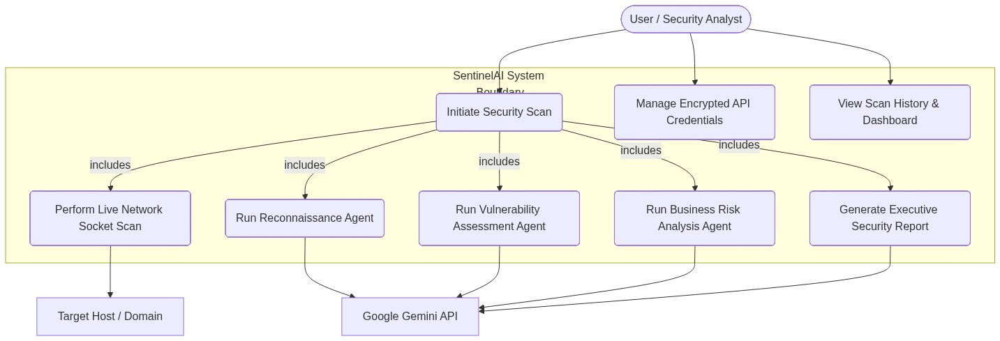
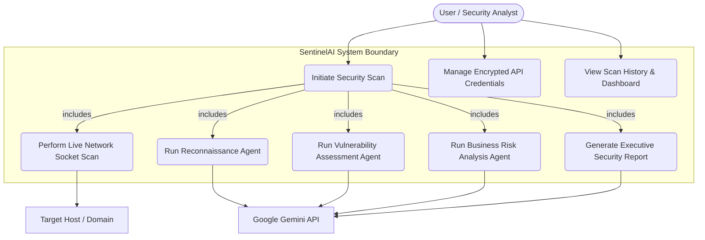
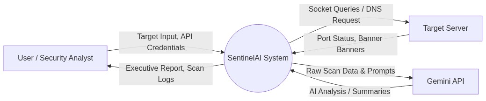
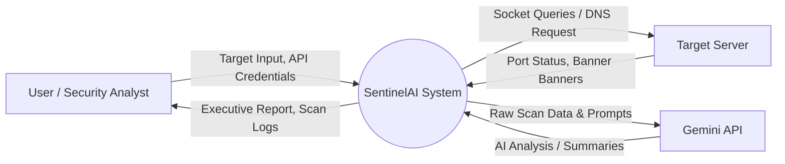
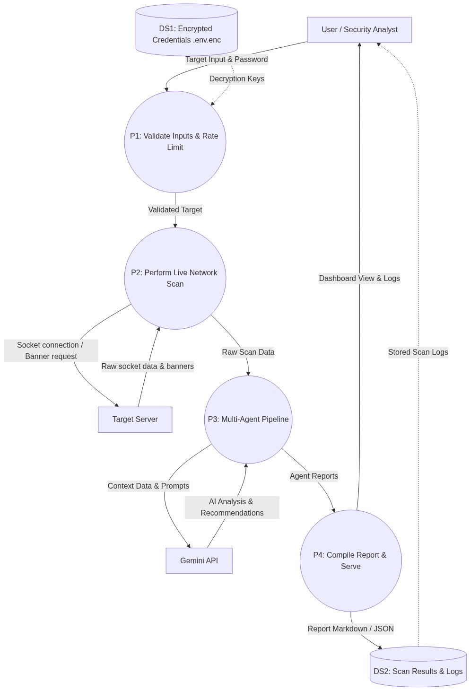
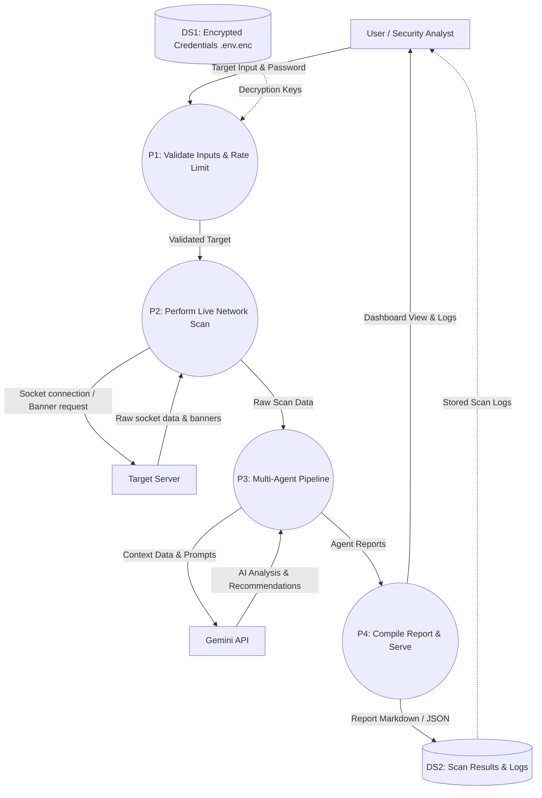
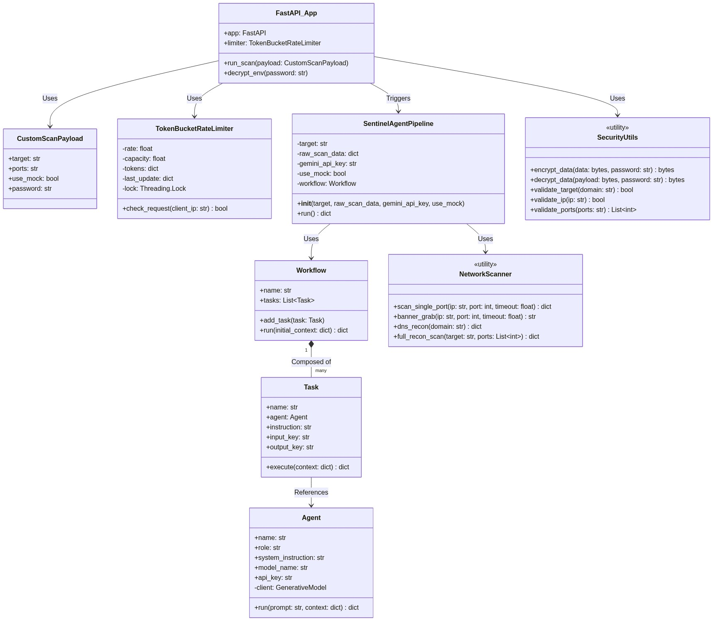
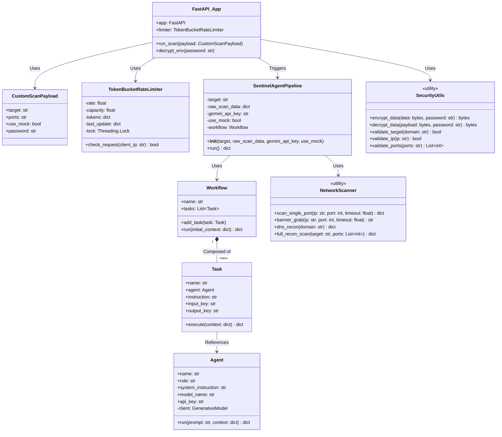
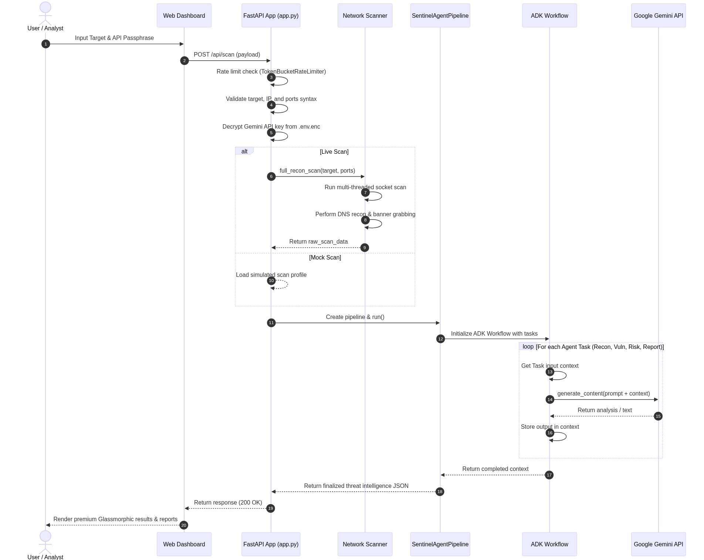
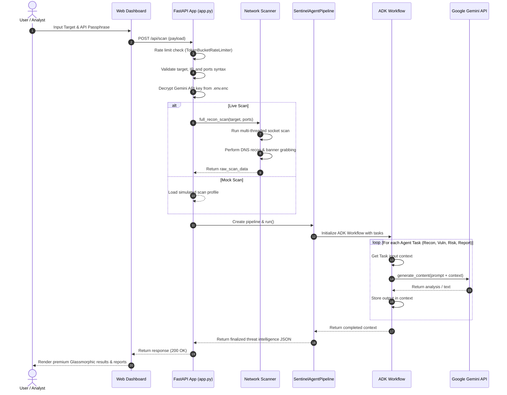

# SentinelAI - Architecture & Flow Diagrams

This document outlines the detailed system architecture, user interactions, data flows, and object-oriented class structure for **SentinelAI** using Mermaid diagrams and rendered PNG images.

---

## 1. Use Case Diagram

The Use Case Diagram shows the interactions between the primary actors (User/Security Analyst, Google Gemini API, and Target Server) and the system.

View Mermaid Source

---

## 2. Data Flow Diagram (DFD)

### Level 0: Context Diagram
A high-level view showing the boundaries of the system and its external entities.

View Mermaid Source

### Level 1: Detailed Data Flow Diagram
A decomposed view showing internal processes, data stores, and data flows.

View Mermaid Source

---

## 3. UML Diagrams

### UML Class Diagram
The Class Diagram models the object-oriented structure of the backend application, agent orchestrator, and utility subsystems.

View Mermaid Source

### UML Sequence Diagram
The Sequence Diagram traces the end-to-end execution flow of a scanning job.

View Mermaid Source

